# 人工智能导论_复旦大学_智慧慕课学习空间

## 绪章

### 课程导引

#### 1. **人工智能：科学的思考方式**

- 像人一样思考 → 理性地思考
- 像人一样行动 → 理性地行动
- → 理性的决策

  - 理性的决策：可以最优地达成预先定义目标的决策
  - “理性”的评价仅仅基于决策（并不在意背后的思考过程）
  - 目标：基于执行结果的效用进行刻画
  - 理性：最大化期望的效用值

#### 2. **课程目标**

- 智能体：一个可以完成*感知*和*动作*的实体。
- 理性的智能体：选择最大化期望效用的动作。
- 核心要素：反馈，环境和动作空间。
- 基于三大核心要素进行动作选择。
- 课程内容：
  - 学习针对一系列问题类型的通用人工智能技术
  - 学习如何使用现有技术进行新问题的建模和求解

#### 3. 人工智能技术学习路径

- 基础_真实世界的问题：路径寻址，吃豆人，五子棋，……
- 抽象_形式化任务（模型）：搜索问题，马尔可夫决策过程，贝叶斯问题，……
- 计算_任务的解决（算法）：深度优先，策略优先，维特比算法

#### 4. 这门课讲了什么？

这门课的核心逻辑非常简单，它只讲了一件事：如何让一个“铁疙瘩”（机器人/智能体）像个明白人一样，学会“做决定”。

- **第一阶段：死脑筋的“规划者” (无信息搜索)**

> 这个阶段的机器人，就像个刚进城的孩子。他知道家在哪（目标状态），知道路怎么走（动作），但他对世界一无所知。

- 逻辑： 既然什么都不知道，那就“笨鸟先飞”，把所有能走的路全试一遍。
- 代表算法：
  - DFS（深度优先）： 认准一条路走到黑，撞了南墙再回头。
  - BFS（广度优先）： 像水波纹一样，先把家门口的路全看一遍，再看远一点的。

困惑： 这种办法太笨了！如果要从北京走到上海，把全国的胡同都走一遍，那不得走死？所以我们要进入下一阶段。

- **第二阶段：有经验的“聪明人” (有信息搜索 & 启发式函数)**

> 这时候，机器人学聪明了，他手里拿了个指南针，或者找了个老乡问路。

- 逻辑： 我不再瞎跑了，我每走一步，都估算一下：“这条路是不是离目标更近了？”
- 什么是“启发式函数”？ 这就是那个“指南针”。比如您找孙子，您知道孙子在学校，那您往学校方向走，肯定比往菜市场走更有可能找到。这个“直觉”就是启发式函数。
- 代表算法：
  - A*算法： 既考虑已经走了多远（历史），又考虑离终点大概还有多远（未来估算）。它是目前最常用的“找路”高手。

- **第三阶段：深谋远虑的“棋手” (对抗搜索 & 估值函数)**

> 这里的情况变复杂了：有人在跟你对着干！

- 逻辑： 比如下棋，我走一步，对方肯定会走一步最让我难受的棋。
- 什么是“估值函数”？ 棋局还没下完，您搭眼一看，说“这盘我占优”，或者“这盘我要输”。
  - 您是怎么判断的？您会数数：我还有几个车？对方还有几个卒？我的将安不安全？
  - 估值函数就是把这种“感觉”变成数字。 机器人没法下到最后一步，它就得在半路停下来，数数自己的“子儿”多不多，来判断这一步好不好。

## 一、无信息搜索

### 1.1 搜索问题定义

#### 1.1.1 搜索问题四要素

- **状态/状态空间**
  - 状态描述一个具体的场景
  - 状态空间包含了所有的可能状态
- **后继函数（动作、损耗）**
  - 状态通过动作选择而产生连接的关系
  - 动作空间表示某一个状态下可以采取的动作集合
- **开始状态**
  - 问题开始的状态
- **结束状态**
  - 问题结束的条件

#### 1.1.2 吃豆人游戏

>背景：小黄人吃豆子，小豆子+大豆子，有敌人，小黄人碰到敌人gg，吃到大豆子可以变大吃敌人

- 状态空间：游戏过程中的某个画面的截图，每一个小格子都是一个状态的可能，所有的格子的状态组成了状态空间
- 后继函数
  - 动作空间：上，下，左，右，动作可以连接两个状态
  - 损耗：每个动作都有损耗，单步损耗为1
  - 如小黄人从（1，1）移动到（1，2），向右移动一格，（1，2）里有豆子，小黄人就吃到了豆子，这个向右一格的动作连接了两个状态
- 开始状态：如小黄人从（1，1）的状态开始，其他格子里有豆子
- 目标测试：如移动到某一个特定的位置/吃完所有豆子

#### 1.1.3 八数码问题

>在 3x3 的格子中有 1~8 八个数字，你可以移动一个数码到它旁边的空格子中，从开始状态达到目标状态
>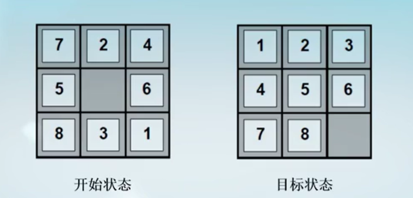

- 状态空间：8 个数码的位置，每一个都可以用二维数组表示（x, y）
- 后继函数：移动空白格子：上，下，左，右

#### 1.1.4 八皇后问题

> 在 8x8 的棋盘上，陆续摆上 8 个皇后，并保证皇后之间两两不互相攻击（皇后可以攻击同一行、同一列、同一正对角线/反对角线的棋子），在图示例子中，我们还需要摆放 3 个皇后 
> 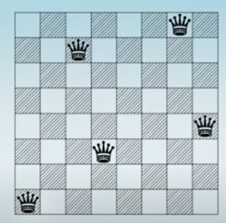

- 状态空间：0 ~ 8 个皇后摆在棋盘上；使用一个 8x8 的矩阵，布尔值
- 后继函数：增加一个皇后到棋盘上
- 开始状态：空白的棋盘
- 目标测试：8 个皇后在棋盘上，两两不攻击

#### 1.1.5 罗马尼亚交通图

> 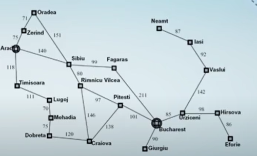

- 状态空间：图中的节点集（城市是节点）
- 后继函数：动作-可以去往有边相连的城市；损耗-城市间的距离
- 开始状态：Arad （城市）
- 目标检测：当前所处的城市是否是 Bucharest？

### 1.2 搜索空间

#### 1.2.1 状态空间

- **全局状态空间**：建模环境中包含的每一个可描述变量（细节），如包括小黄人的位置，豆子分布情况，大豆子小豆子，敌人等等
- **搜索状态空间**：仅需要建模解决特定搜索问题需要的变量，不需要所有的变量
  - 问题：路径寻址
    - 状态：（x, y）小黄人的位置
    - 动作：上下左右
    - 后继：根据动作更新位置
    - 目标：当前状态是否目标位置
  - 问题：吃完所有豆子
    - 状态：{（x,y），豆子分布情况}
    - 动作：上下左右
    - 后继：根据动作状态
    - 目标：所有豆子都被吃了

#### 1.2.2 状态空间的大小 - 八皇后问题

- 全局状态空间：期盼的格子数目 64，皇后的数目 8
- 全局状态空间大小：$64^8$

#### 1.2.3 状态空间的大小 - 吃豆人

- 全局状态空间：小黄人活动空间 120，豆子个数 30，鬼怪活动空间 12，小黄人朝向 上下左右
- 全局状态空间大小：$120*(2^{30})*(12^2)*4$
- 路径搜索状态空间大小：$120$
- 吃完所有豆子状态空间：$120*(2^{30})$

### 1.3 搜索问题的表示：状态空间图和搜索树

#### 1.3.1 状态空间图

- 定义：一种针对搜索问题的数学表示形式
  - 节点：抽象的状态
  - 边：后继函数（状态执行动作的结果）
  - 目标检测：一个目标节点的集合（可能只有一个）
- 在状态空间图中，每一个问题中的状态只出现一次
- 状态空间图中的节点与问题中的状态一一对应

#### 1.3.2 搜索树

- 树是有向无环图，有根节点，边的个数是节点个数减一
  - 开始状态是根节点
  - 子节点对应父节点的后继状态
  - 节点对应状态，并且包含了从开始状态到当前状态的路径，
  - **路径表示一个动作序列**

#### 1.3.3 状态空间图到搜索树的转换

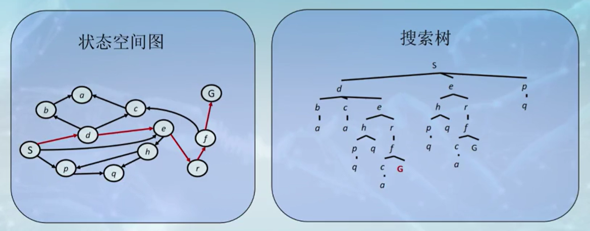

- 搜索树中的一个节点对应状态空间图中的一条完整路径
- 状态空间图中的节点可以对应到搜索树中的多个状态节点，也就是说，**搜索树中不同的节点可能表示相同的状态，只是路径不同**

#### 1.3.4 状态空间图 vs. 搜索树

考虑以下 4 状态的状态空间图，它对应的搜索树是怎么样的？
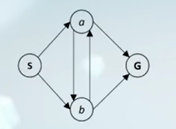

此图中 a,b 一直在循环。在搜索树中包含了非常多的重复结构，因此，对于绝大部分问题来说，我们不能完整画出它对应的搜索树。

### 1.4 搜索算法的基本设定和评测

#### 1.4.1 搜索问题的求解

- 解决一个搜索问题就是确定从开始状态到一个结束状态的动作序列，也被称为规划

#### 1.4.2 搜索算法的标准设定

- 过程
  - 搜索开始：从搜索树的根节点开始
  - 节点扩展：访问一个未被访问的但已经被发现的节点
  - 节点生成：发现新的节点
  - 目标测试：判断当前接待你对应的状态是否是目标状态
- 实现模块
  - 搜索边缘：已经生成但是未被访问的节点集合（fringe）
  - 节点扩展：访问一个节点，并枚举它所有邻居节点
  - 节点生成：将新节点加入到搜索边缘

> 注意：**生成 = 发现， 访问 = 扩展**

#### 1.4.3 搜索算法的评价

- 搜索树中的一些符号 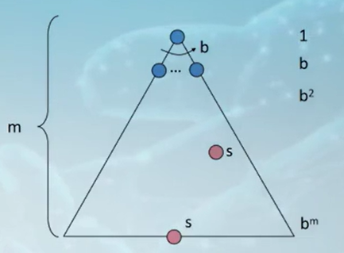
  - b 表示分支因子，树能到达的宽度
  - m 表示最大搜索高度/深度
  - s 目标状态对应的节点（可以为多个）
- 搜索树中的总节点个数：$1+b+b^2+...+b^m = \frac{1-b^{m+1}}{1-b} = O(b^m)$
- 评价搜索算法的四个指标
  - 完备性：如果存在目标节点，是否可以保证搜索到？
  - 最优性：最先找到的目标节点是不是损耗最小的？（如先找到更浅层的目标节点，而不是深的）
  - 时间复杂度：生成的节点个数（如果算法要生成所有的节点，那它的时间复杂度就是 $O(b^m)$
  - 空间复杂度：需要的存储空空间（搜索边缘的大小），即要保存找到的但未访问的节点的空间大小

### 1.5 树搜索和图搜索

#### 1.5.1 树搜索：额外的损耗

- 树搜索无法发现树中的重复结构，因此会产生额外的损耗（多对一的关系）
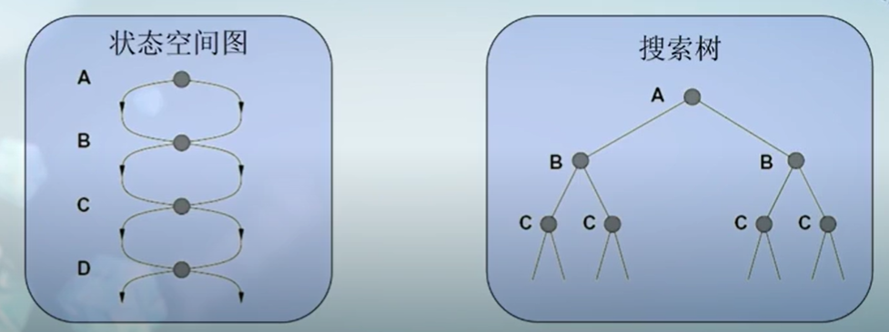
- 树搜索的改进：例子，对红色标记的 e 节点，我们不需要对第三层的 e 节点进行二次访问，因为第二层中已经可以访问 e 节点了，我们为了减少损耗会希望在第二层访问 e 节点

#### 1.5.2 图搜索

- 思路：同一个状态相关的节点不进行重复访问（一对一的关系）
- 实现：树搜索 + 保存访问过的节点集合（“已搜索集合”）
- 更新：每次扩展完一个节点，都更新“已搜索集合”
- 使用：在扩展一个节点之前，检查“已搜索集合”；如果该节点被包含，则跳过对它的扩展

#### 1.5.3 搜索算法的框架（伪代码）

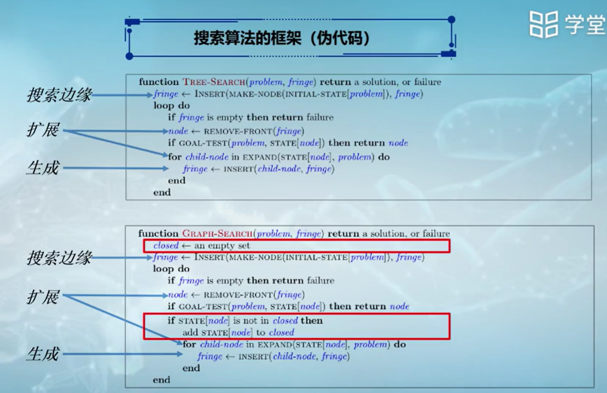

### 1.6 代价无关搜索算法

#### 1.6.1 深度优先搜索（Depth-First Search, DFS）

- 搜索边缘：保存已经生成但是未被访问（扩展）节点的数据结构
- 扩展：从搜索边缘中选择一个节点进行扩展，获得它的所有邻居节点
- 生成：将一个新的节点插入到搜索边缘中
- 搜索策略：选择边缘中深度最大的节点进行扩展（距离根节点步数最多，如层数是 2 则深度为 2）
- 实现：搜索边缘可以使用后进先出的堆栈来实现

#### 1.6.2 深度优先搜索 - 演示

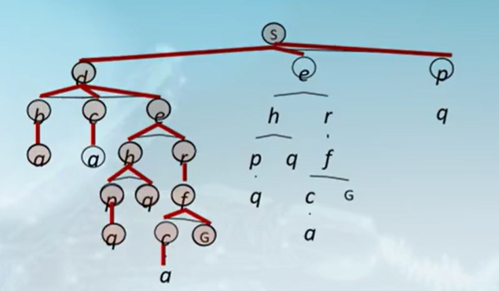

|边缘[~~扩展~~] stack|生成|已探索 set|
|--|--|--|
|~~S~~|p e d|S|
|p e ~~d~~|b c e|S d|
|p e ~~b~~ c e|a|S d b|
|p e ~~a~~ c e| |S d b a|
|p e ~~c~~ e|**a**|S d b **a** c|
|p e ~~e~~|r h|S d b a c e|
|...|...|...|

#### 1.6.3 深度优先搜索（DFS）的性质

- DFS 生成的节点个数（**时间复杂度**）？
  - 由于每次都是向更深的地方搜寻，因此可能要把整棵树都遍历完才会找到目标节点
  - 如果最大树高 m 是有限的，则为 $O(b^m)$
- DFS 需要的搜索边缘的大小（**空间复杂度**）？
  - 每层需要存储 b 个节点，一共 m 层，则为 $O(bm)$
- DFS 是完备的吗？
  - 不，树高 m 可能是无限的，DFS 可能向着一个无限的树高不停深挖，而无法找到另一个枝条的浅层的解
- DFS 是最优的吗？
  - 不，它会找到“最左边”的解，不管这个解的树高是多少

#### 1.6.4 广度优先搜索（Breadth-First Search, BFS）

- 搜索边缘：保存已经生成但是未被访问（扩展）节点的数据结构
- 扩展：从搜索边缘中选择一个节点进行扩展，获得它的所有邻居节点
- 生成：将一个新的节点插入到搜索边缘中
- 搜索策略：选择边缘中深度最小的节点进行扩展（距离根节点步数最少）
- 实现：搜索边缘可以使用先进先出的队列
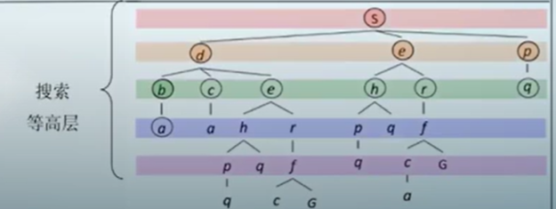

#### 1.6.5 广度优先搜索（BFS）的性质

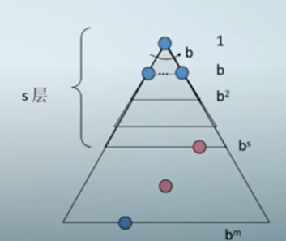

- BFS 生成的节点个数（**时间复杂度**）？
  - 假设树高最小的目标节点在 s 层，需要扩展所有树高大于等于 s 的节点
  - 需要生成的节点个数的复杂度为：$O(b^{s+1})$
  - 为什么是 s+1？因为当找到目标 s 层的时候，它的下一层已经被发现了，所以需要加一层
- BFS 需要的搜索边缘的大小（**空间复杂度**）？
  - 边缘需要保存生成的最后一层的所有节点，即$O(b^{s+1})$
- BFS 是完备的吗？
  - 是
- BFS 是最优的吗？
  - 是（如果每一步的损耗都是一样的）

#### 1.6.6 深度优先（DFS） vs 广度优先（BFS）

- 深度优先的空间复杂度更小
- 广度优先算法的时间复杂度更小，而且更健壮（完备且最优）

#### 1.6.7 迭代加深算法（Iterative Deepening Search, IDS）

- 结合深度优先的空间复杂度优势和广度优先的时间复杂度优势
  - 设定最大搜索深度为1，运行深度优先搜索算法，未发现目标
  - 设定最大搜索深度为2，运行深度优先搜索算法，未发现目标
  - 设定最大搜索深度为3，……
- IDS 生成的节点个数（时间复杂度）？
  - $O(b^s)$
- IDS 需要的搜索边缘的大小（空间复杂度）？
  - $O(bs)$
- 虽然 IDS 和 BFS 的时间复杂度相同，但 IDS 会生成更多的节点
  - $b+(b+b^2)+(b+b^2+b^3) = sb^1+(s-1)b^2+(s-2)b^3+...+b^{s+1} = O(sb^1+(s-1)b^2+(s-2)b^3+...+b^{s+1}) = O(b^{s+1})$

### 1.7 一致代价搜索算法

#### 1.7.1 代价敏感的搜索

- 广度优先搜索可以找到步数最短的搜索路径，但是它假设每一步的代价一样，因此不能保证路径的代价最小
- 接下来我们考虑每一步有不同代价，并学习代价敏感的搜索算法

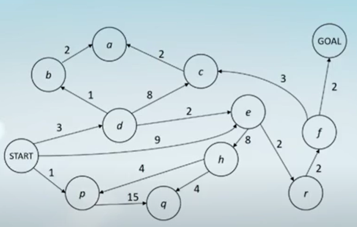

#### 1.7.2 一致代价搜索（Uniform Cost Search, UCS）

- 搜索边缘：保存已经生成但是未被访问（扩展）节点的数据结构
- 扩展：从搜索边缘中选择一个节点进行扩展，获得它的所有邻居节点
- 生成：将一个新的节点插入到搜索边缘中
- 搜索策略：选择边缘中代价最小的节点（从根节点到当前节点的累积代价）
- 实现：搜索边缘可以使用优先队列

#### 1.7.3 一致代价搜索的执行过程

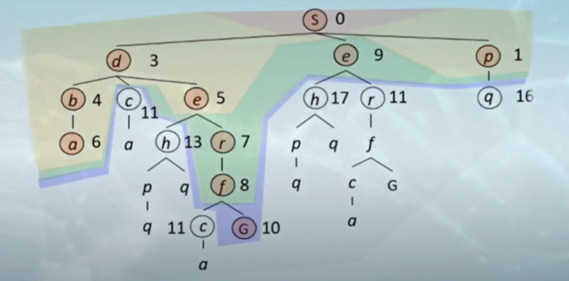

#### 1.7.4 一致代价搜索（UCS）的性质

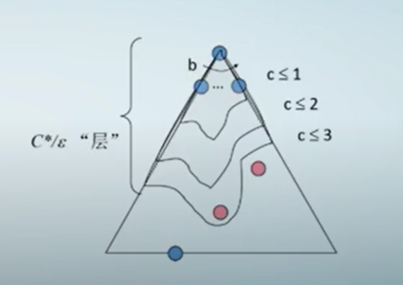

>- C*：最优节点的累积代价
>- ε：搜索树中的最小单步代价
>- C* / ε：有效树高，从根节点到最优目标节点的最大步数

- 时间复杂度：$O(b^{C^* / (ε+1)})$
- 空间复杂度：$O(b^{C^* / (ε+1)})$
- 完备性：是，只要满足以下条件
  - （1）最优目标节点的代价是有限的
  - （2）最小单步代价是非负的
- 最优性：是，只要最小单步代价是非负的

#### 1.7.5 一致代价搜索（UCS）的其它性质

- UCS 遵循代价增加进行节点的依次访问
- 优点：UCS 是完备的和最优的
- 缺点：UCS 不考虑任何目标节点的额外性质，无差别地增加搜索半径

### 1.8 搜索算法对比

|算法|完备性|最优性|时间复杂度|空间复杂度|备注|
|--|--|--|--|--|--|
|DFS|N|N|$O(b^m)$|$O(bm)$|空间复杂度最好，时间复杂度最差；可能出现循环而无解|
|BFS|Y|Y|$O(b^{s+1})$|$O(b^{s+1})$|空间复杂度上需要保存下一层的节点，时间复杂度上也是；不会因为循环而无解|
|IDS|Y|Y|$O(b^s)$|$O(bs)$|结合 DFS 和 BFS 的优势|
|UCS|Y|Y|$O(b^{C^* / (ε+1)})$|$O(b^{C^* / (ε+1)})$|需要引入一个近似有效树高|

- b：分支因子
- s：最优目标节点的树高
- m：搜索树的最大深度
- C*：最优目标节点的累积代价
- ε：搜索树中的最小单步代价

 **假设分支因子和搜索树的最大树高是有限的，单步代价是非负的。**

> 例题：对于有限状态图上的搜索问题，以下说法正确的有（）。
>
> - [x] 深度优先图搜索（DFS）可以保证找到解（如果存在至少一解）
> - [x] 一致代价搜索（UCS）不一定总能找到最优解
> - [x] 存在广度优先树搜索有解而深度优先树搜索无解的案例
> - [ ] 存在深度优先树搜索有解而广度优先树搜索无解的案例

## 二、有信息搜索

### 2.1 启发式函数

#### 2.1.1 有信息搜索

- 在无信息的搜索中，我们只关心过去信息
  - 即：考虑从开始状态到当前节点的损耗（UCS 搜索中的成本），而忽略对于未来损耗的估计
- 在实际应用中，我们往往对搜索树中的节点有一些额外的信息

#### 2.1.2 启发式函数

- 用来估计当前状态离目标状态距离的函数
- 函数一般是为特定的搜索问题而设计的，即问题相关的
- 例如：曼哈顿距离、欧几里得距离，吃豆人为例，要得到小黄人去往豆子的距离 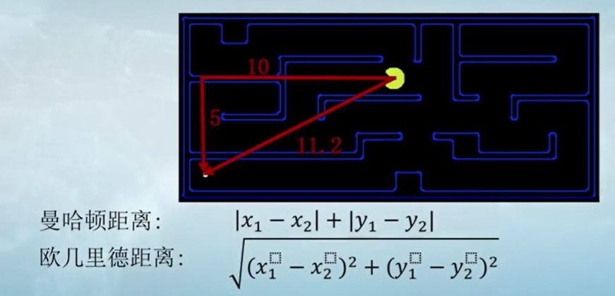
- 用启发式函数可以加速我们的搜索

### 2.2 贪心搜索算法

#### 2.2.1 贪心搜索算法

- 搜索边缘：保存已经生成但是未被访问（扩展）节点的数据结构
- 扩展：从搜索边缘中选择一个节点进行扩展，获得它的所有邻居节点
- 生成：将一个新的节点插入到搜索边缘中
- 搜索策略：选择边缘中启发式函数值最小的节点（离目标“最近”的节点）
- 实现：搜索边缘使用优先队列实现

#### 2.2.2 贪心搜索 - 罗马尼亚旅游

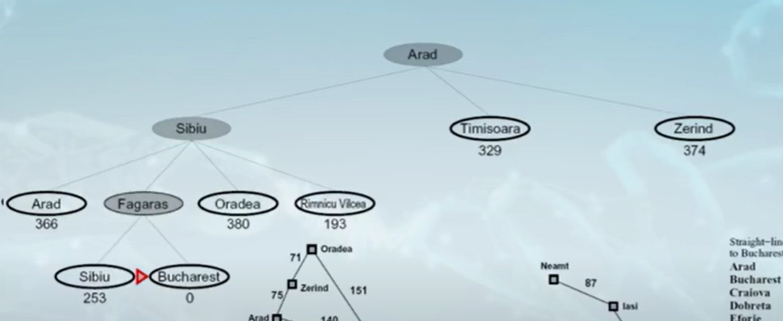

- 看节点到目标城市的直线距离，选择直线距离最短的走
- 已访问的节点也会进入后续的计算和比较
- 最终和目标函数的启发式函数为 0，找到终点

#### 2.2.3 贪心搜索 - 什么时候出错？

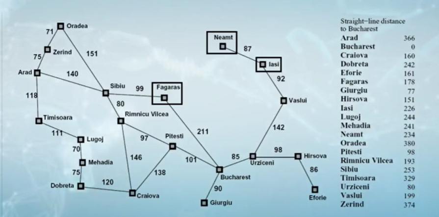

- 从 Lasi 到 Fagaras 
- 最优解：I → V → U → B → F
- 贪心解：I → N → I → N → I ...... 无限循环
- 缺点：贪婪搜索不关心历史损耗

#### 2.2.4 贪心搜索的性质

- 策略：扩展看上去最接近目标状态的节点（最小的启发式函数值）
- 启发式函数：到最近目标的距离
- “最佳优先”会让你直奔目标（可能是错误的） 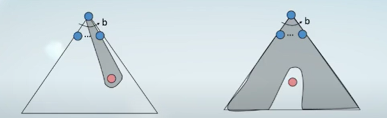
- 不是完备的，可能让你陷入无穷循环的困境中
- 不是最优的

### 2.3 A 搜索算法

#### 2.3.1 A*搜索

- 历史：从起始节点到当前节点的成本
- 未来：从当前节点到目标节点的估计
- A* 同时考虑历史和未来两个维度的信息

- 估值函数 f(n)
  - f(n) = g(n) + h(n)
  - g(n)：从开始节点到当前节点的损耗
  - h(n)：当前节点到目标节点损耗的启发式估计

#### 2.3.2 示例：一致代价搜索 vs 贪心搜索 vs A*

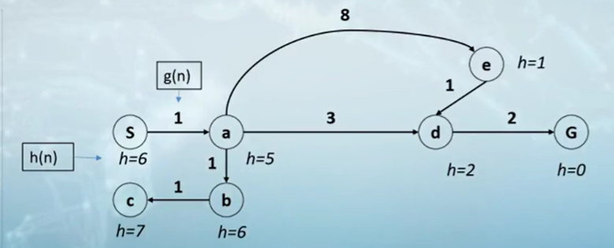

- 写出每个算法选择的搜索路径，S 为起点，G 为终点
  - 假设：g(S) = 0, (G) = 0
- 一致代价：按历史路径的成本 g(n) 做节点访问的优先级排序
- 贪心搜索：按目标接近度或远期成本 b(n) 做节点访问的优先级排序
- A*搜索：结合历史损耗和未来估计 f(n) = g(n) + h(n) 进行排序

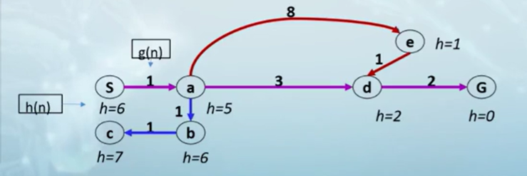

|算法|结果路径|扩展的节点|
|--|--|--|
|最优|S → a → d → G|S, a, d, G|
|一致代价|S → a → d → G|S, a, b, c, d, G|
|贪心|S → a → e → d → G|S, a, e, d, G|
|A*|S → a → d → G|S, a, d, G|

#### 2.3.3 A*是最优的吗？

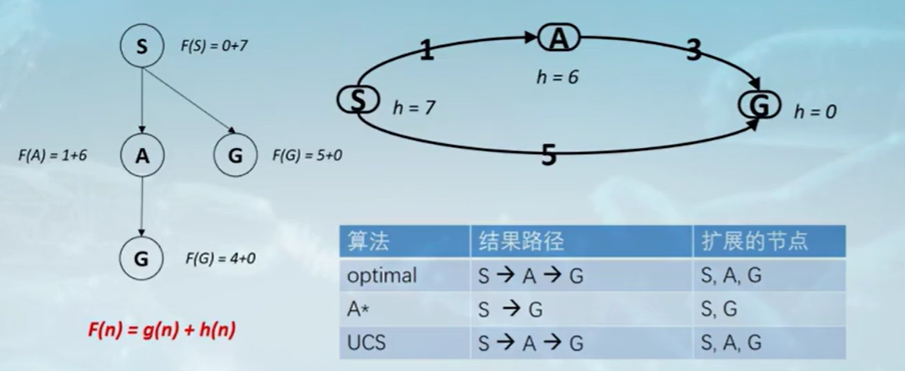

- 我们需要在 G 之前从搜索边缘弹出节点 A 以得到最优解
- F(A) < F(G) → h(A) + g(A) < g(G) + h(G) → **h(A) < g(G) - g(A)**
- **节点的估计应小于节点到目标的实际损耗，才能找到最优的节点 A**

### 2.4 可采纳的启发式函数

#### 2.4.1 可采纳的启发式函数

- 如果启发式函数满足：0 ≤ h(n) ≤ h*(n)，则称之为是可采纳的启发式函数，h*(n)是达到目标的真实代价
- 在 A* 算法中，可采纳的启发式函数是非常重要的

#### 2.4.2 A* 树搜索的最优性

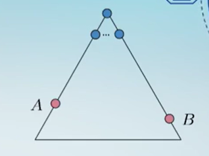

- 假设：
  - A 是一个最优的目标节点
  - B 是次优的目标节点
  - h 是可采纳的
- 断言：
  - A 将在 B 之前访问，即 A 比 B 更早从边缘弹出

**证明（A* 树搜索的最优性）：**

- 情况 1：A 和 B 同时处于边缘
  - A 将被优先扩展
    - f(A) = g(A) + h(A) = g(A)
    - f(B) = g(B) + h(B) = g(B)
    - g(A) < g(B) → f(A) < f(B)
    - 由于 A 最优，B 次优，所以 f(A) < f(B) 是已知的
- 情况 2：B 在 A 之前被插入边缘
  - 证明：A 的所有祖先节点都在 B 之前展开，即 B 不可能在 A 之前被展开 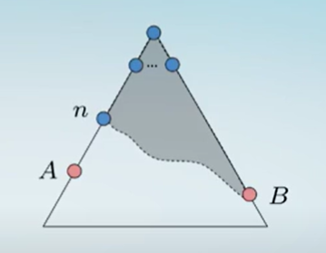
    - 假设：B 在边缘，A 的一些祖先也在边缘
    - 断言：n 将在 B 之前展开
      - 由于 f(n) ≤ f(A)，f(A) < f(B)，所以 n 比 B 先扩展
       > **证明过程：**
       > - *启发式函数的定义*：f(n) = g(n) + h(n)
       > - *h(n) 的可采纳性*：因为 h(n) ≤ g(A) - g(n)，所以 f(n) - g(n) ≤ g(A) - g(n)，所以 f(n) ≤ g(A)
       > - *A 为目标节点时 h(A) = 0*：g(A) = f(A)
       > - 结论：f(n) ≤ f(A) < f(B)，即在任何 A 还没有展开之前的时刻，总存在一个 f(n) < f(A) 的节点，使得算法朝着 A 的方向持续行进

### 2.5 一致的启发式函数

#### 2.5.1 配备可采纳函数的 A* 在图搜索中出错

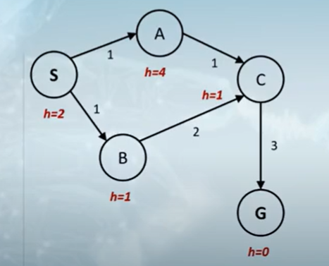

|算法|结果路径|
|--|--|
|optimal|S → A → C → G|
|A* graph|S → B → C → G|

解法：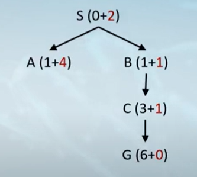

|步骤|优先队列|扩展节点|生成节点|已搜索集合|
|--|--|--|--|--|
|1|S(2)|S|A, B|-|
|2|A(5), B(2)|B|C|S|
|3|A(5), C(4)|C|G|S, B|
|3|A(5), G(6)|A|C*(skip)|S, B, C|
|3|G(6)|G|S, A, B, C|S, A, B, C|

- 因为是图搜索算法，不会对一个节点扩展两次，所以第一次扩展出 C 后，第二次就不会从 A 扩展到 C，而是跳过 C。
- 因此，需要在第一次访问节点 C 的时候，就保证路径的最优性 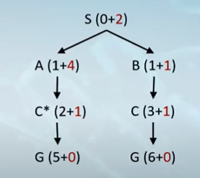
  - C* 需要在 C 之前被扩展
  - C* 的祖先节点需要在 C 之前被扩展
- f(A) < f(C)，即 g(A) + h(A) < h(C) +g(C)，即 h(A) - h(C) < g(C) - g(A)
- **对于搜索图中每一条边的损耗估计都要小于等于实际损耗**

#### 2.5.2 启发式函数一致性

- 主要思想：估计启发式成本 ≤ 实际成本
- 可采纳性：启发式成本 ≤ 目标实际成本
  - h(A) ≤ cost (A to G)
- 一致性：启发式“弧”成本 ≤ 每个弧的实际成本
  - h(A) - h(C) ≤ cost (A to C)
- 图搜索对节点只会扩展一次，因此希望一旦扩展则是最优的
- 一致性带来的结果：
  - 沿路径的 f 值从不减小：h(A) ≤ cost (A to C) + h(C)
- A* 图搜索是最优的

#### 2.5.3 最优性

- 树搜索：
  - 如果启发式函数是可采纳的，则 A* 搜索是最优的
  - UCS 是一个特殊情况（h = 0）
- 图搜索：
  - 如果启发式函数是一致的，则 A* 搜索是最优的
  - UCS 是一个特殊情况（h = 0，启发式函数也是一致的）
- 一致性蕴含可采纳

### 2.6 构建启发式函数

#### 2.6.1 构建可采纳的启发式函数

- 松弛问题：在每个状态下的真实代价都小于或等于原问题的代价
  - 找到原始问题的松弛问题，该松弛问题的解可以作为原问题的可采纳启发式函数值

#### 2.6.2 示例 - 松弛问题 - 八数码问题

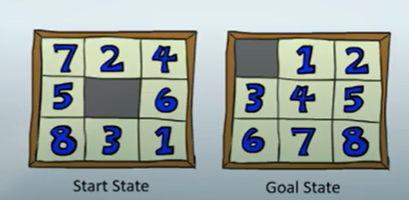

- 如果 A 与 B 相邻且 B 为空，则数码可以从格子 A 移动到格子 B
  - 约束一：A 和 B 相邻
  - 约束二：B 为空

> - 松弛问题一：如果 B 是空的，数码可以从 A 移动到 B
> - 松弛问题二：如果 A 与 B 相邻，则数码可以从 A 移动到 B
> - 松弛问题三：数码可以从 A 移动到 B

启发式函数可以基于原始问题的形式化表达进行自动生成

> 松弛问题一：如果 B 是空的，数码可以从 A 移动到 B

- 启发式函数：不在目标位置的数码数
- h (start) = 8 （有8个数不在目标位置上）
- 松弛问题三的变形：数码可以从 A 移动到 B，将 A 移到 B 的成本始终等于 1

> 松弛问题二：如果 A 与 B 相邻，则数码可以从 A 移动到 B

- 启发式函数：曼哈顿总距离
- h (start) = 3 + 1 + 2 + 2 + 2 + 3 + 3 + 2 = 18
- 松弛问题三的变形：数码可以从 A 移动到 B，而将 A 移到 B 的成本就是两个格子位置的曼哈顿距离

> 子问题 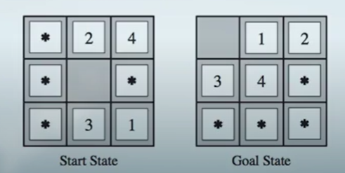

- 指定数码较少的子问题
- 将数码 5, 6, 7, 8 用星号代替，使得他们在移动过程中不加区分
- 任务是将数码 1, 2, 3, 4 移动到正确位置

- **解决子问题的成本不超过其原始问题**

### 2.7 启发式函数的性质

#### 2.7.1 不同启发式函数的比较 - 八数码问题

- IDS：迭代加深搜索（DFS + BFS）
- h1：错误放置的瓷砖数量
- h2：曼哈顿总距离
- 有效分支因子（b*）是基于树中节点的深度和数量来计算的

#### 2.7.2 启发式函数的支配关系

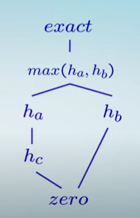

- 支配关系：ha ≥ hc if ∀n: $\forall n: h_a(n) \geq h_c(n)$

- 启发式方法形成一个半格：
  - 可采纳的启发式最大值是可采纳的：$h (n) = \max (h_a (n), h_b (n))$
- 格的底部：启发式函数值为零
- 格的顶部：启发式函数值为真实损耗

#### 2.7.3 启发式函数的性质

- $h_1 ≤ h_2$，占支配地位的启发式函数可以产生更好的结果
- 如果将实际成本用作启发式函数
  - 它是可采纳的
  - 可以节省扩展的节点
  - 但计算成本更高
- 使用 A*：在启发式函数的**估计质量**和**计算消耗**之间进行权衡
- 随着启发式函数值逼近真实代价，将扩展更少的节点，但通常每个节点的启发式函数值的计算需要更多开销

## 三、对抗搜索

### 3.1 博弈的类型

#### 3.1.1 博弈的类型

- 确定性博弈 vs 随机性博弈：围棋象棋 vs 飞行棋大富翁
- 单体博弈 vs 多人博弈：一个，两个或多个玩家
- 零和游戏：得分相加为 0（围棋），魂斗罗就不是零和游戏
- 全息游戏：在博弈过程中是否是双方所有信息都可以观察，如围棋，而 DOTA 游戏就不是全息游戏

#### 3.1.2 零和游戏

- 零和游戏
  - 玩家的效用值互为相反数，效用值的和为零
  - 考虑一个玩家最大化效用，而另一个最小化效用
  - 对抗式的，纯粹的竞争
- 普通游戏
  - 玩家有独立的效用值
  - 合作，竞争，冷漠等都是可能的
  - 经典的博弈论问题：囚徒困境 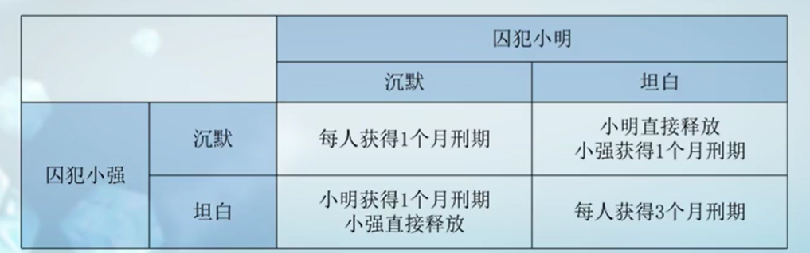

#### 3.1.3 多玩家的确定性博弈

- S: 状态（$s_0$ 是起始状态）
- Player (s): 当前状态下，采取行动的玩家
- Actions (s): 当前状态下，当前轮次玩家可以采取的动作集合
- Results (s, a): 转移函数，返回当前状态和动作的执行结果
- Terminal Test (s): 终结测试，是否为结束状态，布尔值 {true, false} （如玩家的将和帅是否在棋盘上）
- Terminal Utilities (s, p): 效用函数，判断结束状态的效用值（玩家的得分）
- 零和游戏（只用记一个玩家的得分，另一个玩家的得分用常数 - 第一个玩家的得分就可以）

### 3.2 估值函数

#### 3.2.1 极小极大值的算法效率

- 极小极大的效率如何呢？
  - 类似（穷举的）深度优先算法
  - 时间复杂度：$O(b^m)$
  - 空间复杂度：$O(bm)$
- 示例：国际象棋，b = 35, m = 100
  - 精确解法需要的计算量是不能承受的
  - 对于一台每秒计算 1,000,000 节点的计算机需要 $8^{140}$ 年

#### 3.2.2 基于评估函数的截断搜索算法

- 问题：在真实的游戏中，无法搜索到叶子节点（叶子节点：没有子节点的节点）
- 解决方案：截断搜索
  - 设计最大搜索深度
  - 针对非终止节点进行效用评估
- 无法保证最优性
  - 探索深度对结果的影响很大
- 如何确定合适的搜索深度？
  - 使用迭代加深

#### 3.2.3 评估函数

- 在截断搜索中，评估函数对非终止节点进行效用值计算
- 常见方法：
  - 线性组合方式：
    - 设计手工特征及其权重计算效用值，对特征进行线性组合
    - $Eval(s) = w_1f_1(s) + w_2f_2(s) + ... + w_nf_n(s)$
      - $Eval(s) = material + mobility + king-safety + center - control$
      - $material = 10^{100}(K - K') + 9(Q - Q') + 5(R - R') + 3(B - B' + N - N') + 1(P - P')$
      - $mobility = 0.1(num-legal-moves - num-legal-moves')$
  - 表格法：基于表格的效用值评估
    - 利用预计算的分数快速评估状态（不现实，不可能用表格存储所有状态）
    - 在开局和收盘阶段可以发挥更大的效果
  - 基于机器学习的方法
    - 结合历史棋谱自动学习特征权重或完全由神经网络决定特征选择。

#### 3.2.4 评估函数的性质

- 设计评估函数的原则
  - 正确：获胜状态的效用值应该是高于平局的
  - 高效：评估函数的计算时间消耗应该尽量小
  - 一致：效用值的大小应该与赢得游戏的几率相关

### 3.3 剪枝算法

#### 3.3.1 极小极大值的示例

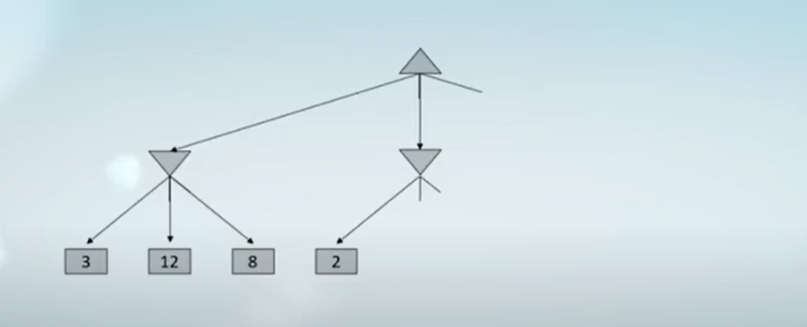

- 第一个极大值节点，都是 > 3 的，第二个极小值节点，都是 < 2 的，展开 2 之后知道后面的都比 2 小，就不用展开了

#### 3.3.2 针对 MIN 节点的剪枝：Alpha-Beta Pruning for MIN node

- 假设一棵搜索树的根节点是 MAX 节点，它当前的最大效用值是 a
- 我们在计算节点 n 的 MIN 值
- 我们开始遍历 n 的子节点
- n 节点效用值的估计是随着它的子节点的发现而下降的
- 如果 n 节点的效用值变得比 a 小，它的效用值便不会被根节点 MAX 所采用，所以我们可以停止考虑 n 的其他孩子

#### 3.3.3 针对 MAX 节点的剪枝：Alpha-Beta Pruning for MAX node

- 假设一棵搜索树的根节点是 MIN 节点，它当前的最大效用值是 b
- 我们在计算节点 m 的 MAX 值
- 我们开始遍历 m 的子节点
- m 节点效用值的估计是随着它的子节点的发现而增加的
- 如果 m 节点的效用值变得比 b 大，它的效用值便不会被根节点 MIN 所采用，所以我们可以停止考虑 m 的其他孩子

#### 3.3.4 Alpha-Beta 剪枝（Pruning）

- 使用两个参数为每个节点设置效用值的范围 [Alpha, Beta]
- 更新过程
  - Alpha：在 MAX 节点上更新，表示当前节点能达到的最大效用值
  - Beta：在 MIN 节点上更新，表示当前节点能达到的最小效用值
- 剪枝过程
  - MAX node：如果当前效用值大于 beta，则剪掉子树
  - MIN node：如果当前效用值小于 alpha，则剪掉子树

#### 3.3.5 Alpha-Beta Implementation

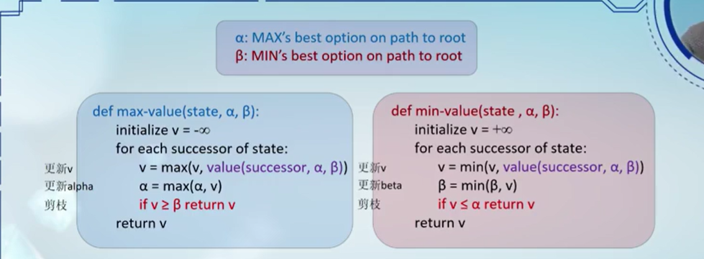

- 在 MAX 节点中更新 alpha，并利用 beta 对 MAX 子树进行剪枝
- 在 MIN 节点中更新 beta，并利用 alpha 对 MIN 子树进行剪枝

#### 3.3.6 对抗搜索（Minimax）

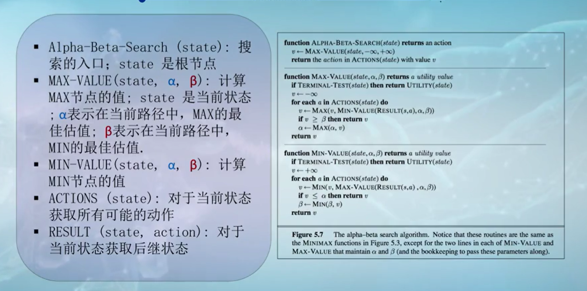

Example

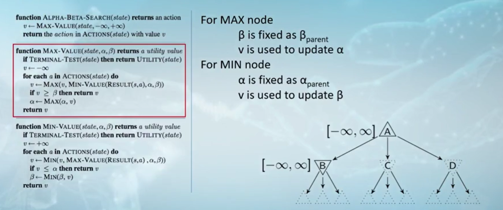

#### 3.3.7 Alpha-Beta 剪枝性质

- 剪枝不影响根节点的极小极大值的计算
- 中间节点的极小极大值在执行剪枝算法之后可能是错误的

- 遍历子节点的顺序对算法的执行有影响
  - 好的遍历顺序可以提高剪枝效率
  - 效用值递减遍历对 MAX 节点更有效
  - 效用值递增遍历对 MIN 节点更有效
  - 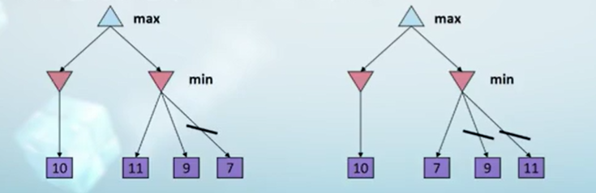

### 3.4 期望对抗搜索

#### 3.4.1

#### 3.4.2

#### 3.4.3

#### 3.4.4

#### 3.4.5

### 3.5 其他博弈类型

#### 3.5.1

#### 3.5.2

#### 3.5.3

#### 3.5.4

#### 3.5.5

### 3.6 期望的效用

#### 3.6.1

#### 3.6.2

#### 3.6.3

#### 3.6.4

#### 3.6.5

### 3.7 对抗搜索

#### 3.7.1

#### 3.7.2

#### 3.7.3

#### 3.7.4

#### 3.7.5

## 四、约束满足问题

### 4.1 约束满足问题的定义

### 4.2 约束图

### 4.3 约束满足问题的性质

### 4.4 回溯搜索

### 4.5 回溯搜索的提升 - 变量和值的选择

### 4.6 回溯搜索的提升 - 过滤

### 4.7 回溯搜索的提升 - 树结构

## 五、强化学习 - 有模型的方法

### 5.1 序列决策问题

### 5.2 马尔可夫决策过程

### 5.3 马尔可夫决策过程样例

### 5.4 值迭代算法

### 5.5 期望最大搜索树中的值迭代

### 5.6 策略评估

### 5.7 策略迭代

## 六、强化学习 - 无模型的方法

## 七、强化学习 - 值函数近似的方法

## 八、概率图模型 - 表示

## 八、概率图模型 - 推理

## 八、概率图模型 - 隐马尔可夫模型

## 九、强化学习模块

## 十、搜索算法模块